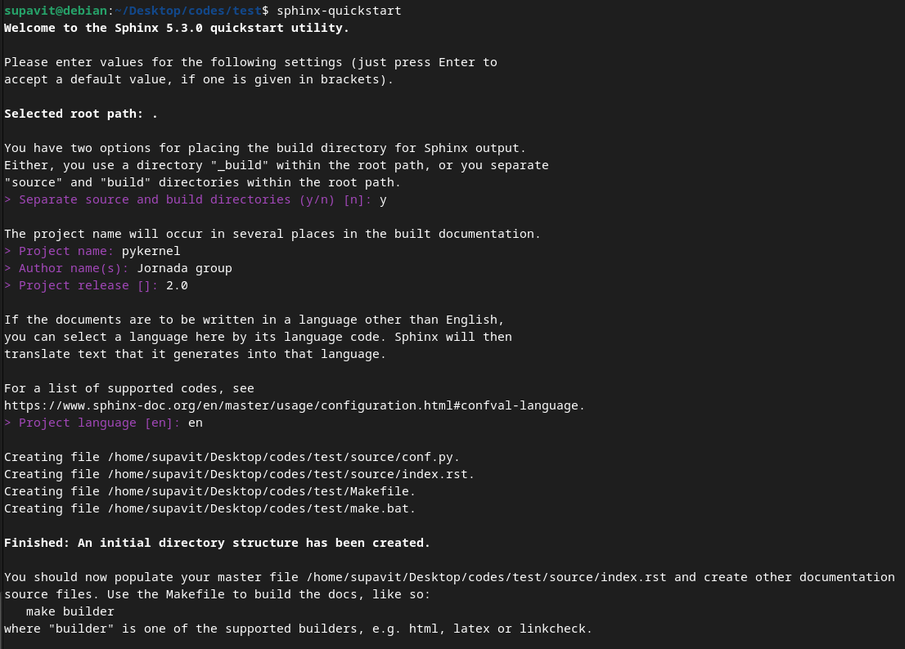

Overview
========

Using Sphinx is simple. Just run :code:`sphinx-quickstart` and the code will
guide you through a questionaire.

Here are screenshots of :code:`sphinx-quickstart` that I used to generate
:code:`pykernel` documentation.

Here the code simply asks 5 questions:

1. Separate source and build directory. Source is the directory that the code
   store :code:`.rst` files. Build is the directory in which :code:`html` or
   :code:`man` pages are stored. It is recommended to keep them separate.

2. Project name

3. Author name

4. Project release version

5. Project language

You can always go back and edit these parameters in :code:`source/conf.py`.

After you finished answering the questionaie, simply run `make html` to
generate your first sphinx html file!
